# Azure-Data-Factory-Training

## Key Vault

<br />

### Key Vault の作成

- Azure ポータルを表示

- リソース グループの管理ブレードへを表示し、**＋ 作成** をクリック

  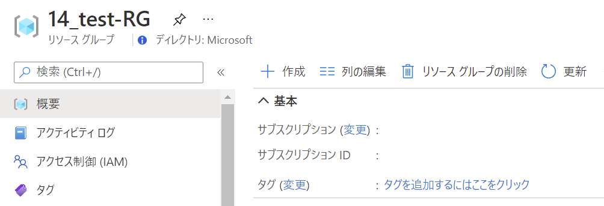

- リソースの作成画面で検索ボックスに **Key Vault** と入力

  表示される候補より **Key Vault** を選択

  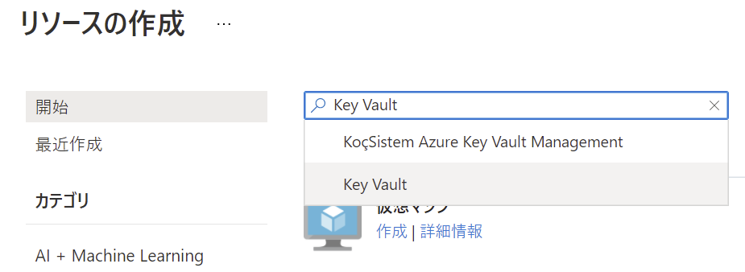

- **作成** をクリック

  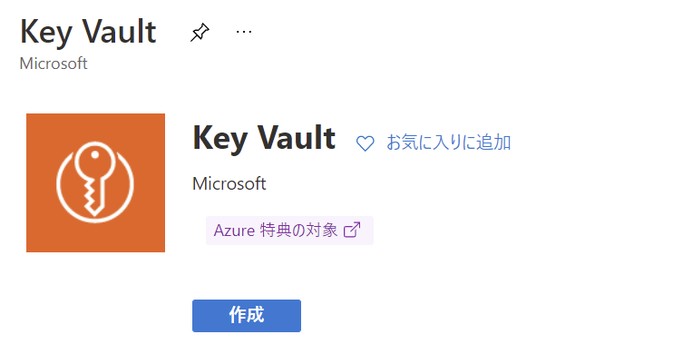

- **Key Vault 名** を入力し、**確認および作成** をクリック

  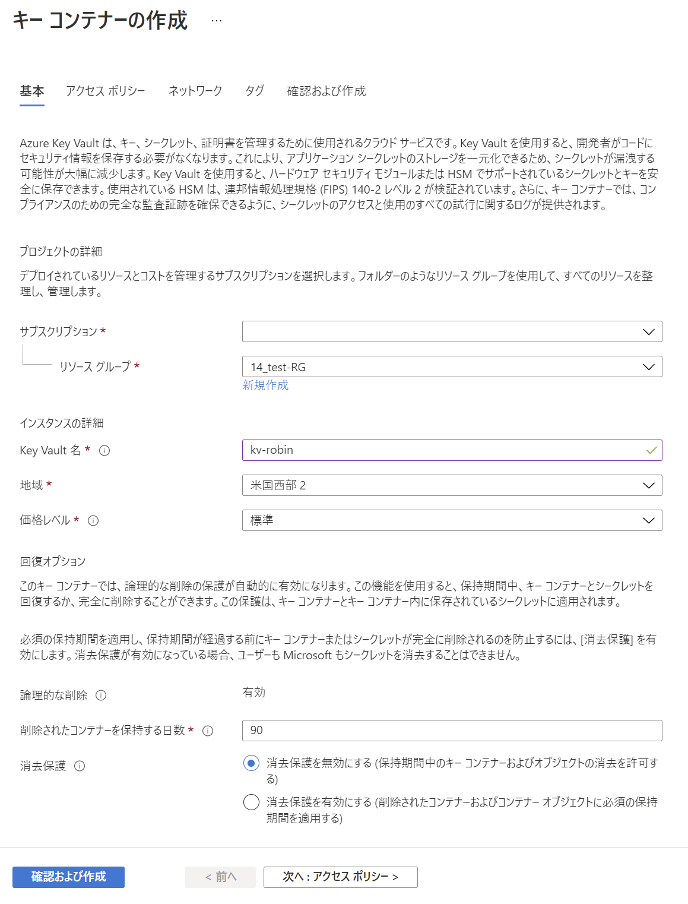

- **作成** をクリックし、デプロイを実行

<br />

### マネージド ID の作成

- ポータル画面右上のアイコンをクリックし Cloud Shell を起動

  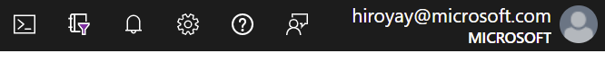

  ※ 初回起動時はストレージの作成を実行

- Set-AzDataFactoryV2 コマンドを実行し、マネージド ID を作成

  ```
  Set-AzDataFactoryV2 -ResourceGroupName <resourceGroupName> -Name <dataFactoryName> -Location <region>
  ```
- Azure Data Factory の管理ブレードを表示し **プロパティ** を選択

- **管理 ID オブジェクト ID** をコピー

  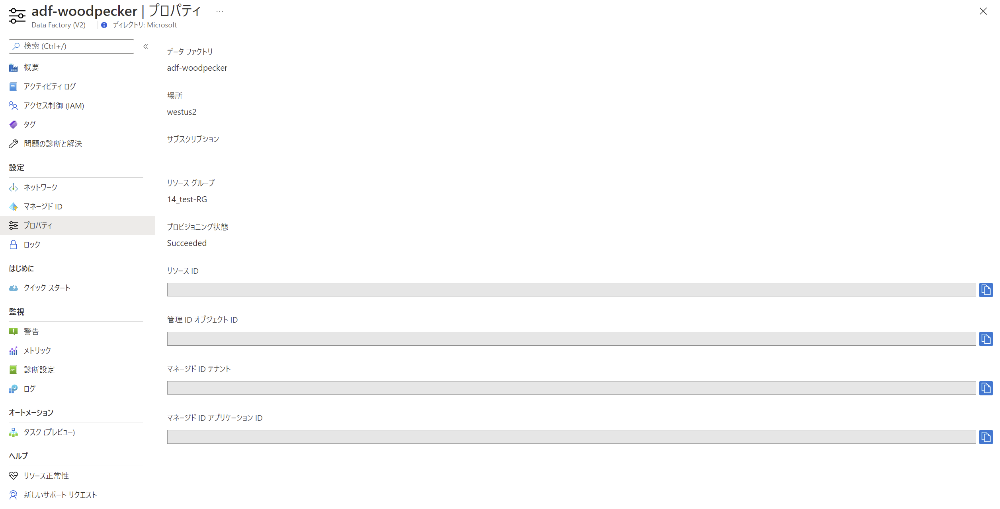

<br />

### シークレットの作成

- ストレージ アカウントの管理ブレードを表示

- **セキュリティとネットワーク** の **アクセス キー** を選択

  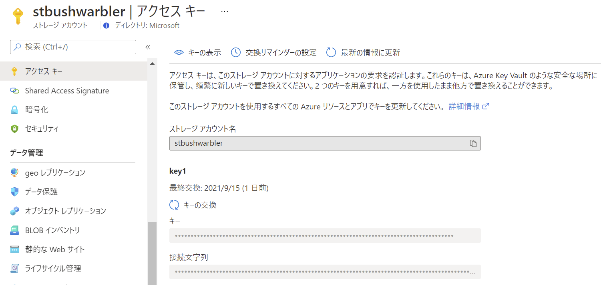

- **キーの表示** をクリックし、**接続文字列** をコピー

- Key Vault の管理ブレードから **設定** の **シークレット** を選択

- **＋ 生成/インポート** をクリック

  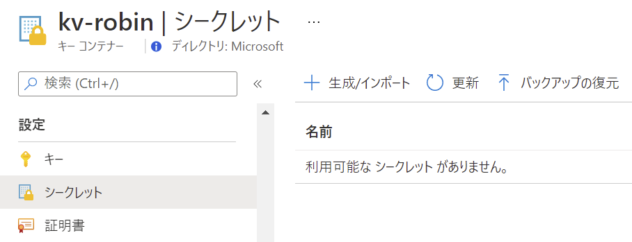

- 必要情報を入力し **作成** をクリック

  - アップロード オプション： **手動**

  - 名前： 任意

  - 値： ストレージ アカウントへの接続文字列

    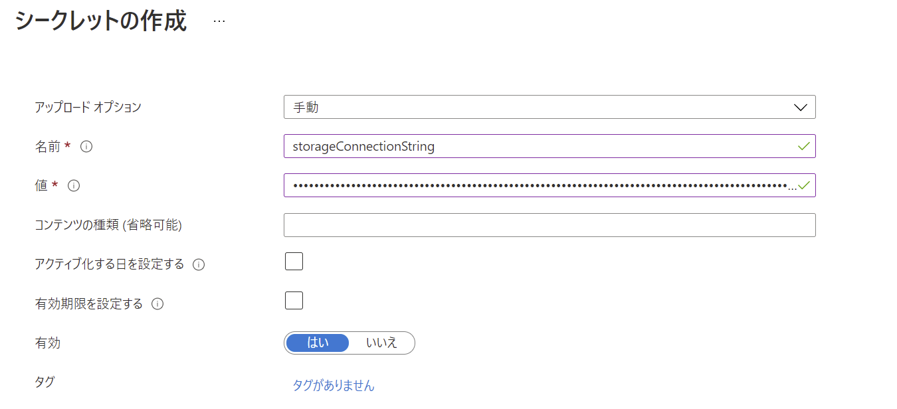

- シークレットが正常に作成されたことを確認

  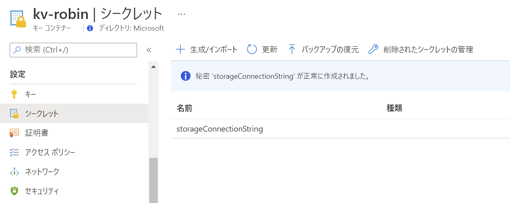

<br />

### アクセス ポリシーの追加

- Key Vault の管理ブレードから **設定** の **アクセス ポリシー** を選択

- **アクセス ポリシーの追加** をクリック

  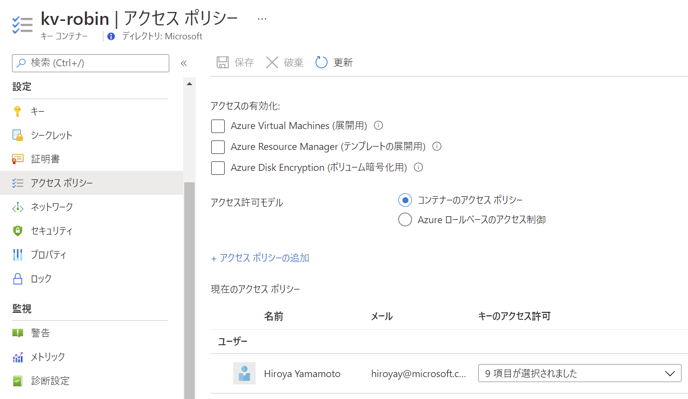

- シークレットのアクセス許可で **取得** と **一覧** にチェック

  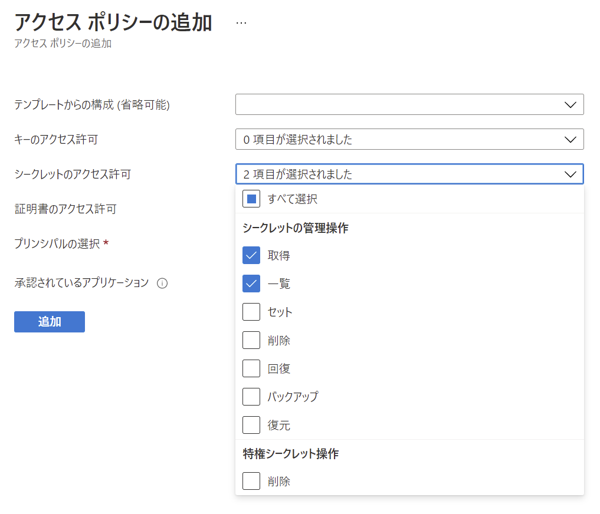

- プリンシパルの選択の **選択されていません** をクリック

- コピーした ID を貼り付け表示されるマネージド ID を選択し **選択** をクリック

  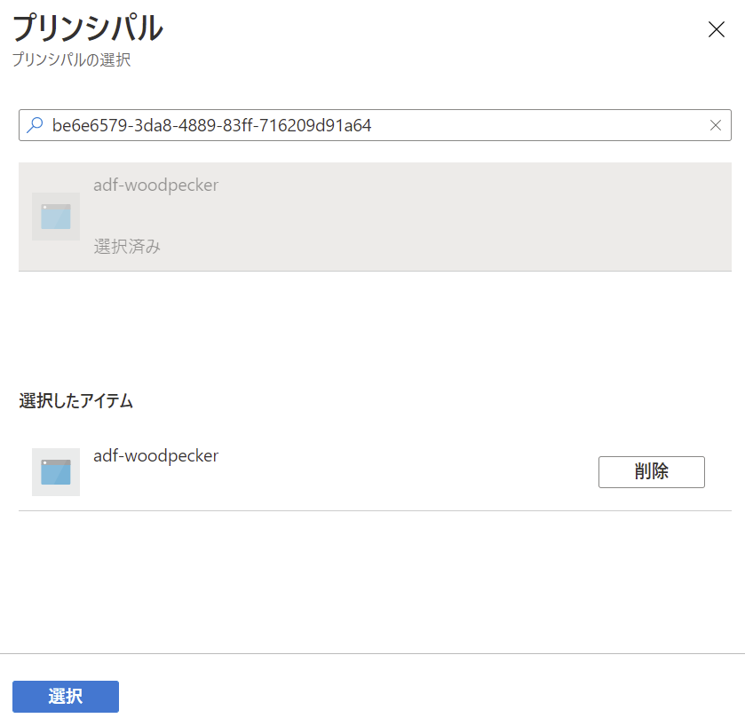

- **追加** をクリック

  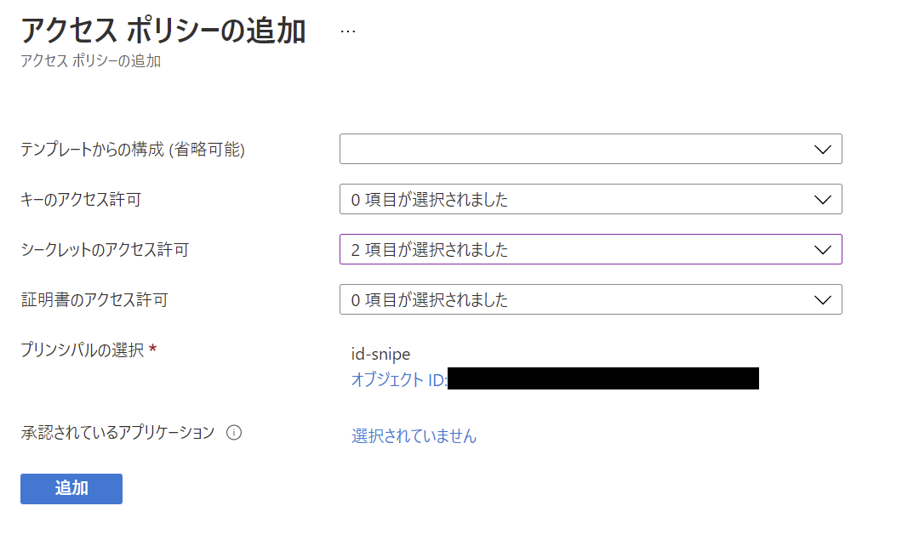

- **保存** をクリック

  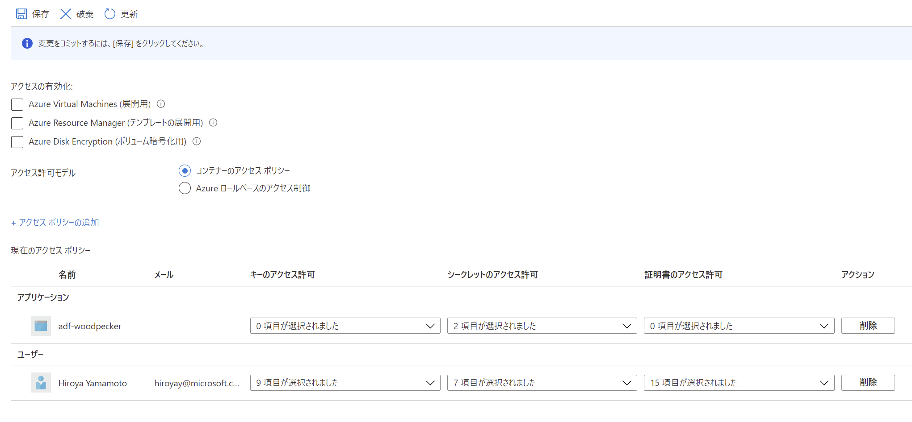

<br />

### Azure Key Vault リンク サービスの作成

- Azure Data Factory Studio へ移動

- **管理** タブの **リンク サービス** を選択し、**＋ 新規** をクリック

- 新しいリンク サービス画面で **Azure Key Vault** を選択し、**続行** をクリック

  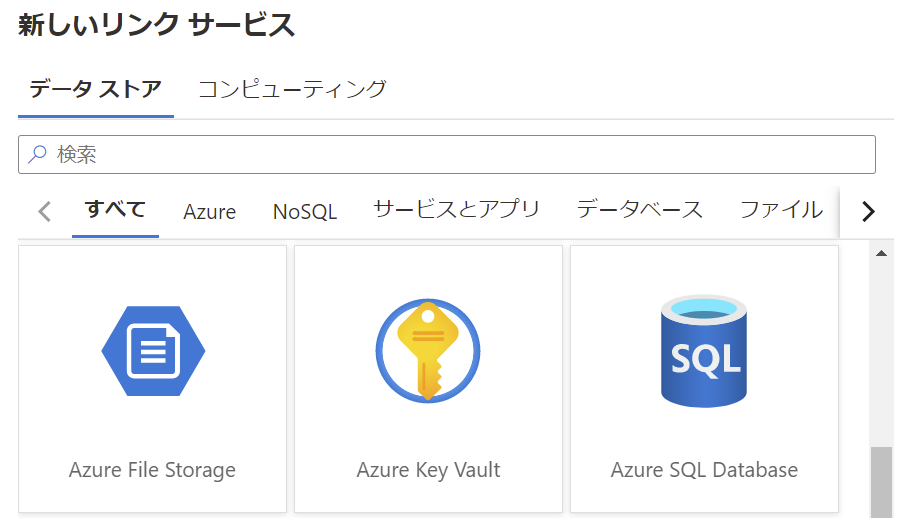

- 先の手順で作成した Key Vault を選択し、**作成** をクリック

  - 認証方法： マネージド ID

  - Azure Key Vault の選択方法

    - Azure サブスクリプション： 使用するサブスクリプション

    - Azure Key Vault の名前： 作成した Key Vault の名前

    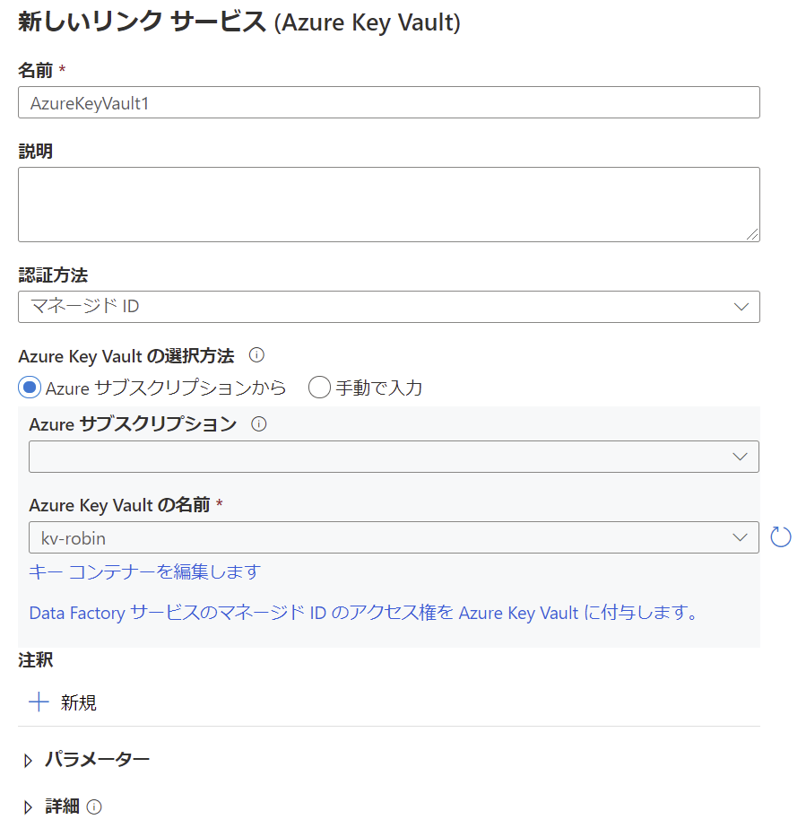

<br />

### Azure BLOB ストレージ リンク サービスの更新

- リンク サービスの一覧から Azure BLOB ストレージへのリンク サービスを選択

- Azure Key Vault へ変更

  - 認証方法： アカウント キー

  - Azure Key Vault を選択

  - AKV のリンク サービス： 先の手順で作成した Azure Key Vault のリンク サービス

  - シークレット名： ストレージ接続文字列を格納したシークレット

    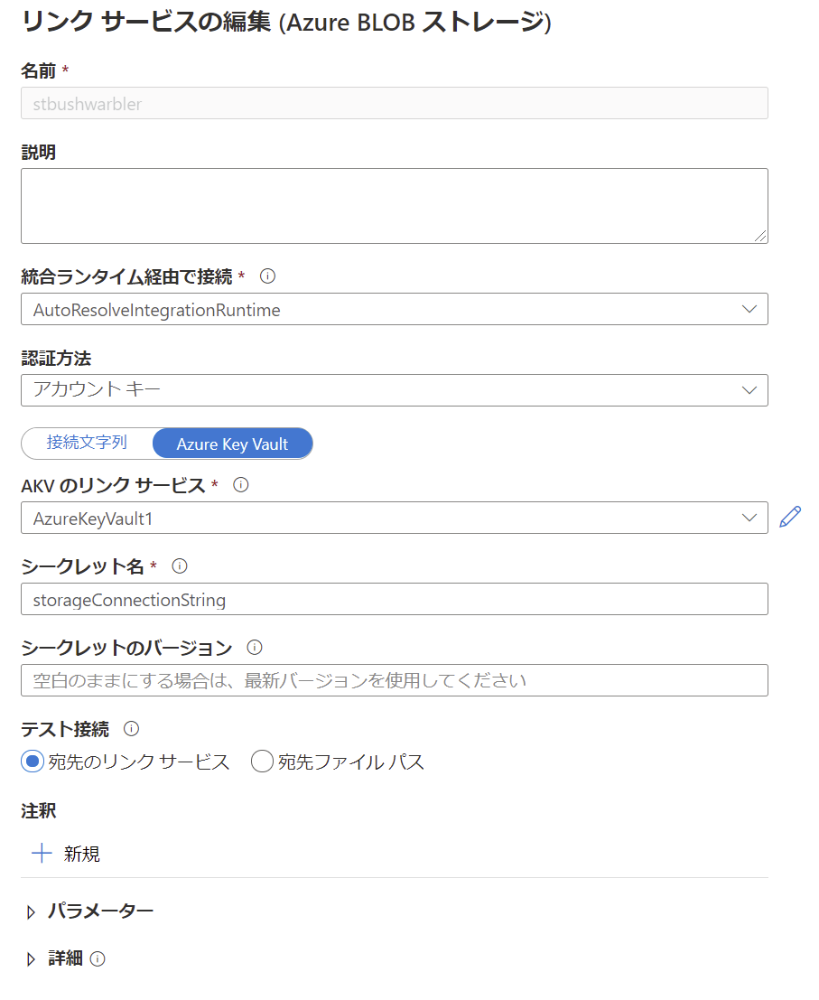

- **テスト接続** をクリックし、接続が成功することを確認

  **保存** をクリックし、リンク サービスを更新

  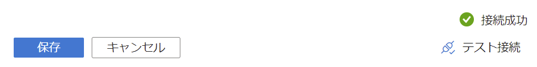