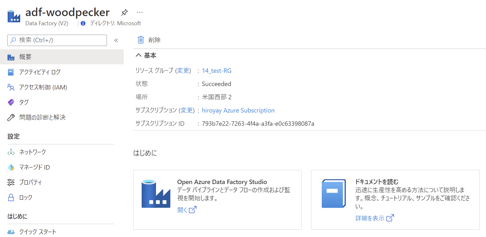

# Azure-Data-Factory-Training

## Blob ストレージ から SQL Database へのデータ コピー

 

### Azure Data Factory Studio の起動

- リソース グループから Azure Data Factory を選択

- Open Azure Data Factory Studio の **開く** をクリック

  

- Azure Data Factory Studio が別タブで起動

  

 