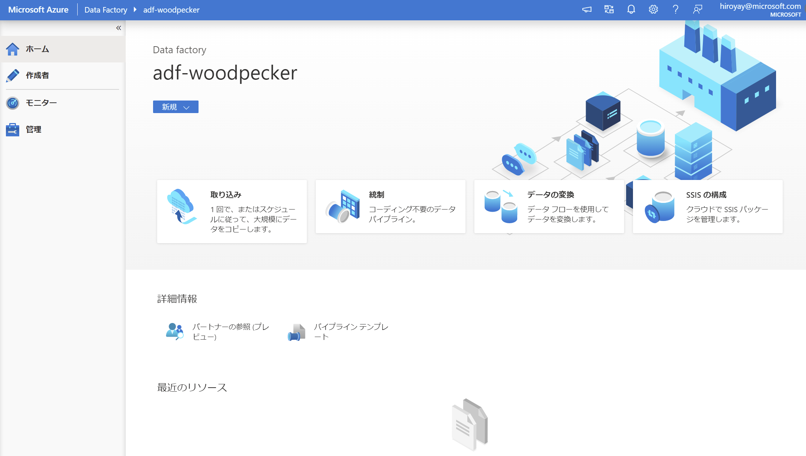
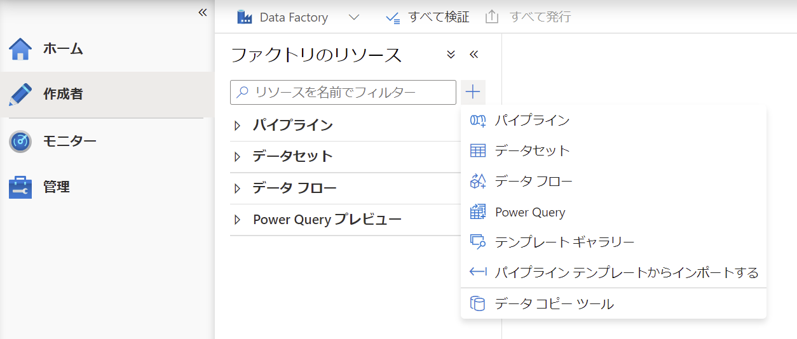
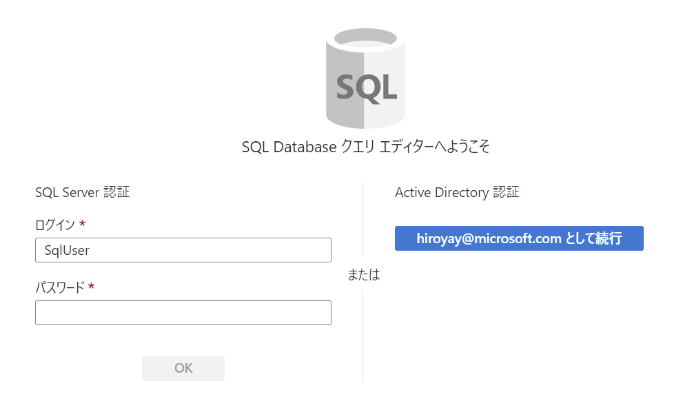

# Azure-Data-Factory-Training

## Blob ストレージ から SQL Database へのデータ コピー

<br />

### Azure Data Factory Studio の起動

- リソース グループから Azure Data Factory を選択

- Open Azure Data Factory Studio の **開く** をクリック

  

- Azure Data Factory Studio が別タブで起動

  

<br />

### パイプラインの作成

- **作成者** メニューをクリックし、ファクトリのリソースにある **＋** アイコンをクリック

  **パイプライン** を選択

  

- 画面右のプロパティでパイプライン名を入力

- **アクティビティ** - **移動と変換** にある **データのコピー** アクティビティをドラッグ＆ドロップして配置

  

- **ソース** タブを表示、ソースデータセットの **＋ 新規** をクリック

- 新しいデータセット画面で **Azure BLOB ストレージ** を選択し、**続行** をクリック

- 形式の選択画面で **DelimitedText** を選択し、**続行** をクリック

  

- データセットの設定を行い **OK** をクリック

  - 名前： 任意

  - リンク サービス： Blob ストレージへのリンク サービス

  - ファイル パス： .csv ファイルをアップロードしたコンテナー

  - 先頭行をヘッダーとして： オン

  - スキーマのインポート： 接続またはストアから

    

- **ソース** タブの **ファイル パスの種類** で **ワイルドカードファイル パス** を選択

  ファイル名に ***.csv** を入力

  

- **シンク** タブを表示、シンクデータセットの **＋ 新規** をクリック

- 新しいデータセット画面で **Azure SQL Database** を選択し、**続行** をクリック

- データセットの設定を行い **OK** をクリック

  - 名前： 任意

  - リンク サービス： ResellerSalesDW データベースへのリンク サービス

  - テーブル名： **dbo.SalesOrder**

    

- 設定終了後の **シンク** タブ

  

- **デバッグ** をクリックし、パイプラインを実行

  

- **出力** タブで実行状況を確認

  

- 状態が成功になったことを確認し、メガネ アイコンをクリック

  

- パイプライン実行の詳細を確認

  

- Azure ポータルへ移動、ResellerSalesDW を選択し、クエリ エディター (プレビュー) を起動

  SQL 認証でログイン

  

- **テーブル** を展開し、**SalesOrder** テーブルを右クリック

  表示されるメニューより **Select Top 1000 Rows** を選択

  

- 結果にコピーされたレコードが表示されることを確認

  

  ※ TotalAmount 列の値が空白であることを確認

- 次のタスクへ進む前にコピーしたレコードを削除

  ```
  TRUNCATE TABLE [dbo].[SalesOrder];

  SELECT COUNT(*) FROM [dbo].[SalesOrder];
  ```
