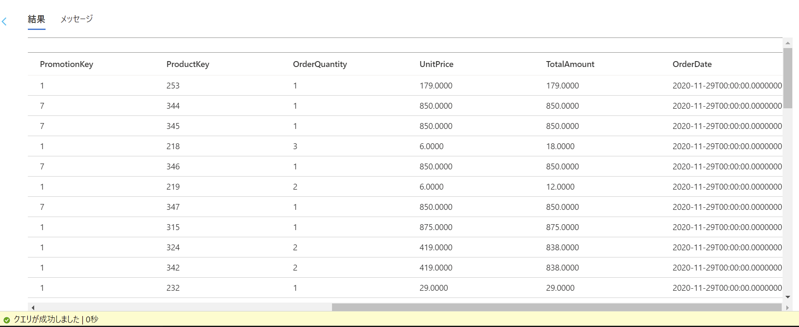

# Azure-Data-Factory-Training

## Blob ストレージ から SQL Database へのデータ フロー

<br />

### Azure Data Factory Studio の起動

- リソース グループから Azure Data Factory を選択

- Open Azure Data Factory Studio の **開く** をクリック

  

- Azure Data Factory Studio が別タブで起動

  

<br />

### パイプラインの作成

- **作成者** メニューをクリックし、ファクトリのリソースにある **＋** アイコンをクリック

  **パイプライン** を選択

  

- 画面右のプロパティでパイプライン名を入力

- **アクティビティ** - **移動と変換** にある **データ フロー** をドラッグ＆ドロップして配置

- **設定** タブを表示、**データ フロー** の **＋ 新規** をクリックし、新しいデータ フローを作成

- **ソースの追加** をクリック

- **ソースの設定** タブの **データセット** リストから先のタスクで作成した CSV ファイルのデータセットを選択

  

- **ソースのオプション** タブを表示、**ワイルドカード パス**のファイル名に **2021??.csv** と入力

  

- **プロジェクション** タブを表示、**OrderQuantity**, **UnitPrice** 列データ型を変換

  - **OrderQuantity**: **integer**

  - **UnitPrice**: **decimal**

    

- **source1** の右下の **＋** アイコンをクリック、表示されるメニューより **派生列** を選択

  

- **派生列の設定** タブを表示、**式** のテキストボックスをポイントし **式ビルダーを開く** をクリック

  

- 式ビルダーで数量、単価を乗算した新たな列を作成

  - 列名：**TotalAmt**

  - 式： `multiply(OrderQuantity, UnitPrice)`

    

- **保存して終了** をクリックし、式ビルダーを終了

- **派生列の設定** タブの列に設定した内容が表示

  

- **派生列** アクティビティ右下の **＋** アイコンをクリック、表示されるメニューから **シンク** を選択

- **シンク** タブを表示、**データセット** のリストから SalesOrder テーブルのデータセットを選択

  

- **マップ** タブを表示、自動マッピングを解除し、列のマッピングを設定

  

- パイプラインのデザイン画面を表示し、**デバッグ** をクリック

- **出力** タブに表示されるパイプラインを選択し、メガネ アイコンをクリックしデータフローの実行状況を表示

- データフローの各コンポーネントをクリックし詳細な情報を確認

  

- Azure ポータルへ移動、ResellerSalesDW を選択し、クエリ エディター (プレビュー) を起動

  SQL 認証でログイン

  

- **テーブル** を展開し、**SalesOrder** テーブルを右クリック

  表示されるメニューより **Select Top 1000 Rows** を選択

  

- 結果にコピーされたレコードが表示されることを確認

  

  ※ TotalAmount 列に計算された値が表示されることを確認

- クエリ エディターで以下のクエリを実行

  ```
  SELECT MAX(OrderDate) FROM [dbo].[SalesOrder]
  ```

  ※ 2021-12-29 までのデータのみが追加されていることを確認

<br />

### 動的パラメーターを使用したフィルタ処理

- Azure Data Factory Studio へ移動、先の手順で作成したデータフローを表示

- データフローのデザイン画面で空白部分をクリックし、**パラメーター** タブを表示

  **＋ 新規** をクリックし、新しいパラメーターを作成

  - 名前： **currentYear**

  - 種類： **string**

    

- パイプラインのデザイン画面を表示、**データ フロー** アクティビティを選択

- **パラメーター** タブを表示、**値** のテキストボックスを選択し、**動的なコンテンツの追加** をクリック

  

- 関数を追加

  - 関数： '@utcnow('yyyy')'

    

- **OK** をクリックし、**値** に追加した関数が表示されることを確認

  

- データフローのデザイン画面を表示

- **ソースのオプション** タブを表示、**ワイルドカード パス** のファイル名を選択

  **動的なコンテンツの追加** をクリックし、式ビルダーを起動

  

- **式** に関数を追加し、**保存して終了** をクリックし、式ビルダーを終了

  ```
  concat($currentYear, '??.csv')
  ```

- **ソースのオプション** タブの **完了後** にある **ソース ファイルの削除** を選択

  

- パイプラインのデザイン画面を表示、**デバッグ** をクリックし、パイプラインを実行

- **出力** タブに表示されるパイプラインを選択し、メガネ アイコンをクリックしデータフローの実行状況を表示

- データフローの各コンポーネントをクリックし詳細な情報を確認

  

- Azure ポータルへ移動、ResellerSalesDW を選択し、クエリ エディター (プレビュー) を起動

  SQL 認証でログイン

  

- クエリ エディターで以下のクエリを実行

  ```
  SELECT MAX(OrderDate) FROM [dbo].[SalesOrder]
  ```

  ※ 2021 年のデータが追加されたことを確認

- ストレージ アカウントの管理ブレードを表示

- CSV ファイルをアップロードしたコンテナーを表示

  

  ※ 2021 年の CSV ファイルが削除されていることを確認

<br />

### トリガーによるパイプラインの起動

- Azure Data Factory Studio へ移動、先の手順で作成したデータフローを表示

- パイプラインのデザイン画面を表示、**トリガーの追加** - **新規/編集** をクリック

  

- **トリガーの選択** で **＋ 新規** を選択

  

- 新しいトリガーを作成し、**続行** をクリック

  - 名前： 任意

  - 種類： **ストレージ イベント**

  - アカウントの選択方法： **Azure サブスクリプションから**

    - Azure サブスクリプション： 使用する Azure サブスクリプション

    - ストレージ アカウント名： CSV ファイルをアップロードしたストレージ アカウント

    - コンテナー名： CSV ファイルをアップロードしたコンテナー

  - イベント： **BLOB が作成されました**

  - トリガーの開始： 作成時のトリガー開始をオン

- データのプレビュー画面で **続行** をクリック

- 新しいトリガー画面で **OK** をクリック

- **すべて発行** をクリック

- 発行する内容を確認し、**発行** をクリック

  

- **通知** で発行が完了したことを確認

  

- Azure ポータルへ移動、ストレージ アカウントの管理ブレードを表示

- コンテナへ CSV ファイルをアップロード

  

  ※ 202104.csv ファイルをアップロード

- Azure Data Factory Studio へ移動

- **モニター** タブの **パイプライン実行** を選択し、トリガーによりパイプラインが起動したことを確認

  

- パイプラインの実行が完了したことを確認し、詳細を表示

  

- Azure ポータルへ移動、ResellerSalesDW を選択し、クエリ エディター (プレビュー) を起動

  SQL 認証でログイン

  

- クエリ エディターで以下のクエリを実行

  ```
  SELECT MAX(OrderDate) FROM [dbo].[SalesOrder]
  ```

  ※ 2021 年 4 月のデータが追加されたことを確認

- リソース グループを表示

  

  ※ BLOB ストレージへのファイル作成のイベントを検知する Event Grid システム トピックが作成されていることを確認