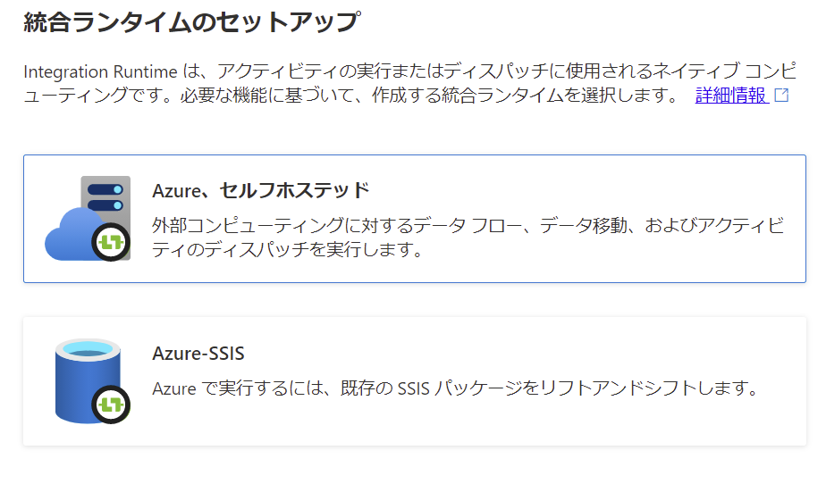
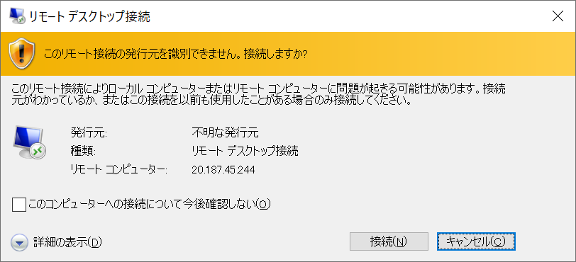

# Azure-Data-Factory-Training

## セルフホステッド ランタイム

 

### セルフホステッド統合ランタイムの作成

- Azure Data Factory Studio へ移動

- **管理** タブの **統合ランタイム** を選択し、**＋ 新規** をクリック

  

- 統合ランタイムのセットアップ画面で **Azure、セルフホステッド** を選択し **続行** をクリック

  

- **セルフホステッド** を選択し、**続行** をクリック

  

- 名前を入力し、**作成** をクリック

  

- 表示される **認証キー** をコピーして、メモ帳などに貼り付け

  

- 作成したセルフホステッド統合ランタイムの状態が **使用不可** であることを確認

  

 

### 統合ランタイムのインストール

- Azure ポータルへ移動し、仮想マシンの管理ブレードを表示

- **接続** - **RDP** を選択

  

- **RDP ファイルのダウンロード** をクリック

  

- リモート デスクトップ接続のダイアログが表示、**接続** をクリック

  

- 仮想マシンに接続するためのアカウント名、パスワードを入力し **OK** をクリック

  

- **はい** をクリックし、仮想マシンへ接続を実行

  

- ブラウザを起動し、Integration Runtime のダウンロード ページへアクセス

  URL: https://www.microsoft.com/ja-jp/download/details.aspx?id=39717

  ※ Internet Explorer 起動前にセキュリティ強化の構成はオフに設定

  

- **ダウンロード** をクリック

  

  ※ バージョンは最新のモノを選択

- ダウンロード完了後、インストーラーを起動

  言語を選択し、**Next** をクリック

  

- License Agreement に同意し、**Next** をクリック

  

- インストール場所を確認し、**Next** をクリック

  

- **Install** をクリックし、インストールを実行

  

- インストールが完了したことを確認し **Finish** をクリック

  

- Integration Runtime 構成マネージャーが起動

  

- 先の手順でコピーした認証キーを貼り付け **登録** をクリック

  

- **完了** をクリック

  

- ノードが正常に登録されたことを確認し、**構成マネージャーの起動** をクリック
  

- クラウド サービスへ正常に接続されていることを確認

  

- Azure Data Factory Studio へ移動

- **管理** タブの **統合ランタイム** を選択

  セルフホステッド統合ランタイムの状態が **正常** に更新されたことを確認

  