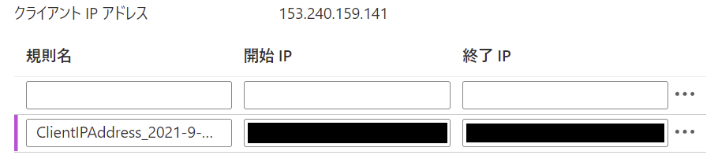

# Azure-Data-Factory-Training

## Index

- Azure リソースの作成
- コンテンツの準備
  - 必要ファイルのダウンロード
  - Blob ストレージへのコンテナー作成、ファイルのアップロード
  - SQL Server へのデータベースのインポート
  - SQL Server のファイアウォール規則の作成
  - SQL Database にテーブルを作成

 

## Azure リソースの作成

事前にリソースを展開するためのリソース グループを作成

- **ARM テンプレート**

  使用する Azure リソースを作成（指定パラメーター以外の設定は以下）

  - **ストレージ アカウント**

    - ストレージ冗長性： Local

    - アクセス層： Hot

  - **SQL Database**

    - コンピューティングとストレージ： 汎用目的、サーバーレス（第5世代,  1 vCore, 5GB ストレージ）

    - バックアップ ストレージの冗長性： Local

    - データベース名： ResellerSalesDW

    - 照合順序： SQL_Latin1_General_CP1_CI_AS

  - **Azure Data Factory**

    - バージョン： V2

    - マネージド仮想ネットワーク： 無効

    - 接続方法： パブリック エンドポイント

    - Git 構成： 後で構成する

  - **仮想ネットワーク**

    サブネット２つ

  - **仮想マシン**

    展開した仮想ネットワークに Windows 仮想マシンを展開

    - イメージ： 2019-Datacenter-smalldisk

    - サイズ： Standard_B2ms

    - OS ディスクの種類： StandardSSD_LRS

    - パブリック IP アドレス： 有効

   

  

  ### パラメーター
  - **storageAccountName**: ストレージ アカウント名
  - **sqlServerName**: SQL Server 名
  - **sqlAdministratorLogin**: サーバー管理者
  - **sqlAdministratorPassword**: パスワード
  - **dataFactoryName**: Data Factory 名
  - **virtualNetworkName**: 仮想ネットワーク名
  - **addressPrefix**: IPv4 アドレス空間
  - **subnetName1**: サブネット名
  - **subnetPrefix1**: サブネット アドレス範囲
  - **subnetName2**: サブネット名
  - **subnetPrefix2**: サブネット アドレス範囲
  - **virtualMachineName**: 仮想マシン名
  - **adminUserName**: ローカル管理者
  - **adminPassword**: パスワード

 

## コンテンツの準備

- コンテンツのダウンロード

  <a href="">https://github.com/hiroyay-ms/Azure-Data-Factory-Training</a> を表示
  
   **Code** をクリックし、**Download ZIP** を選択、ダウンロード後、任意の場所に解凍

- コンテナーの作成

  - リソース グループから作成したストレージ アカウントを表示

  - 左側のメニューにある **コンテナー** をクリック

  - **＋ コンテナー** をクリックし、新しいコンテナーを作成

    - **名前**： （任意）3 文字以上、63 文字以下で小文字、数字、ハイフンのみ可

    - **パブリック アクセス レベル**: プライベート（匿名アクセスはありません）

      

  - 同様の操作でもう１つコンテナーを作成

- ファイルのアップロード

  - 作成したコンテナーにアクセスし、**アップロード** をクリック

  - ダウンロードしたコンテンツ内の Database フォルダーの **ResellerSales.bacpac** ファイルをアップロード

    

    

  - もう片方のコンテナーをアクセスし、同様の手順で .csv ファイルをアップロード

    ※ 202005.csv から 202103.csv の 10 ファイル

    ※ 複数ファイルを選択することで一括アップロードが可

    

    

- データベースのインポート

  - リソース グループから作成した SQL Server を選択

  - **データベースのインポート** をクリック

    

  - バックアップの選択、データベースの構成を行い、管理者のパスワードを入力

    

    ※ バックアップは先の手順でアップロードした **ResellerSales.bacpac** ファイルを選択

    ※ データベースの構成

    - サービス レベル： **汎用目的**（既定）

    - コンピューティング レベル： **サーバーレス**

    - ハードウェア構成： **第 5 世代**（既定）

    - 最大仮想コア数/最小仮想コア数： **1 vCore** / **0.5 仮想コア**

    - 自動一時停止： **自動一時停止を有効にする**（既定）/1 時間

    - データの最大サイズ： **5** GB

      
    
  - **OK** をクリックし、データベースのインポートを実行

- テーブルの作成

  - SQL Server のメニューから **ファイアウォールと仮想ネットワーク** を選択

  - **＋ クライアント IP の追加** をクリック

    

  - 現在のアクセスしている IP アドレスを許可するルールが追加されたことを確認し、**保存** をクリック

    

  - 「サーバーのファイアウォール規則が正常に更新されました」のメッセージを確認し、**OK** をクリック

  - SQL Server のメニューから **SQL データベース** を選択し、表示されるデータベースの **ResellerSalesDW** をクリック

  - メニューから **クエリ エディター (プレビュー)** を選択

  - **SQL Server 認証** の **ログイン**、**パスワード** を入力し、**OK** をクリック

    

    ※ 送信で TCP 1433 ポートが許可されている必要があります

  - ダウンロードしたコンテンツ内の **Database** フォルダーにある **CreateProductTable.sql** の内容をコピーし貼り付け

    

  - **実行** をクリックしテーブルを作成

  - 「クエリが成功しました」のメッセージを確認し、画面左の **テーブル** を展開し、テーブルが作成されていることを確認

    

  - 同様の手順で Promotion, Reseller, SalesTerritory, SalesOrder テーブルを作成

    

- インポートしたデータベースの確認

  - リソース グループまたは SQL Server から **ResellerSales** データベースを選択

  - **クエリ エディター (プレビュー)** を選択し、SQL Server 認証でログイン

  - **テーブル** を展開し、任意のテーブルの右にある **...** をクリック

    **Select Top 1000 Rows** を選択

    

  - SELECT 句が実行され、結果に登録されているレコードが表示されることを確認

    